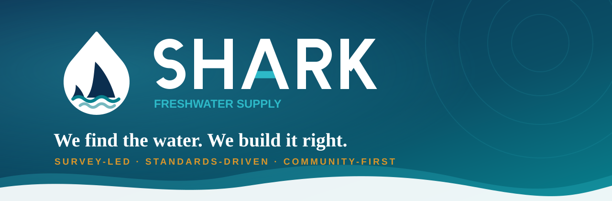
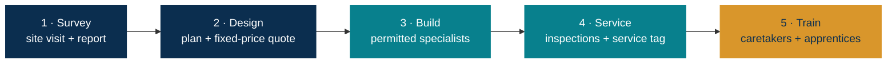
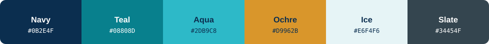

<div align="center">



# Shark Freshwater Supply

**The official website for a Ugandan freshwater supply and construction company that surveys first, builds to standard, and trains the people who keep the water flowing.**


[Quick start](#-quick-start) · [Pages](#-whats-inside) · [Add your photos](#-adding-real-photographs) · [Go live](#-go-live-checklist) · [Brand](#-brand-system)

</div>


## 💧 The idea

Too many water systems in rural and peri-urban Uganda are built without first understanding what lies underground, and left without anyone trained to keep them running.

Shark does it differently, and the website is built to prove it:

| | Principle | What it means for a customer |
|---|---|---|
| 🔍 | **Survey-led** | We find the water before we build, with a registered hydrogeologist, and we keep the evidence. |
| 📐 | **Standards-driven** | Permitted specialists, honest records, a written warranty and a service tag on every system. |
| 🤝 | **Community-first** | Local jobs, training and mentorship, and respect for every community we work in. |



## ✨ What the site does

- **Converts enquiries.** Every call to action opens a pre-filled **WhatsApp** message, the channel Ugandan customers actually use. There is no server, no form backend and no database.
- **Builds trust with evidence.** An **Our Work** gallery where every project is shown with its **place, date and result**. If a project cannot be verified, it is not shown.
- **Opens doors with institutions.** A dedicated **Partner with us** page and downloadable PDFs (company profile, capability statement, executive summary) for districts, companies and NGOs.
- **Sells the survey.** **Shark Water Survey** is explained as a product in its own right.
- **Works on a weak connection.** System fonts, no external scripts, SVG graphics, mobile-first layout, and photographs the owner can compress.
- **Is accessible by default.** Skip link, keyboard-reachable carousel with a Pause control, visible focus states, `prefers-reduced-motion` respected, semantic landmarks.
- **Is findable.** Per-page titles and descriptions, and `Plumber` structured data (JSON-LD) targeting Kampala, Mukono and Wakiso.

## 📂 What's inside

| Page | File | Purpose |
|---|---|---|
| **Home** | [`index.html`](index.html) | Hero slideshow, trust points, services, process, impact, work preview, FAQ |
| **Services** | [`services.html`](services.html) | Home plumbing, water systems, sanitation and drainage, farms and materials |
| **Our Work** | [`work.html`](work.html) | Filterable project gallery with place, date and result |
| **Survey** | [`survey.html`](survey.html) | The Shark Water Survey offer |
| **About** | [`about.html`](about.html) | Founder story, journey, values, current company status, careers |
| **Partner** | [`partner.html`](partner.html) | Pilot proposition for districts, companies and NGOs |
| **Contact** | [`contact.html`](contact.html) | WhatsApp enquiry form, phone and location |

```text
shark-freshwater-supply/
├── index.html · services.html · work.html · survey.html
├── about.html · partner.html · contact.html
└── assets/
    ├── style.css            design system and components
    ├── site.js              menu, WhatsApp links, slideshow, filters, reveal
    ├── downloads/           company profile, capability statement, executive summary
    └── img/
        ├── logo*.svg · icon-*.svg · favicon.svg
        ├── scenes/          illustrated placeholders (fallbacks)
        └── photos/          ← drop real photographs here
```

## 🚀 Quick start

No build step, no install, no server.

```bash
git clone https://github.com/SpeakPower-commits/shark-freshwater-supply.git
cd shark-freshwater-supply
open index.html            # macOS · use `xdg-open` on Linux, `start` on Windows
```

Prefer a local server (recommended when testing links)?

```bash
npx serve .                # or: python3 -m http.server 8080
```

### Deploy

Because the site is plain static files, it runs anywhere:

| Host | How |
|---|---|
| **GitHub Pages** | Settings → Pages → *Deploy from a branch* → `main` / root |
| **Cloudflare Pages / Netlify / Vercel** | Connect the repo, no build command, output directory `.` |
| **Any web host** | Upload the folder contents to the web root |

## 📸 Adding real photographs

Every image slot ships with an illustrated placeholder, so the site looks finished from day one. To replace one, save a compressed JPG at the path below. **No code change needed**; the real photo automatically sits on top of the illustration.

| File in `assets/img/photos/` | Where it appears | Shape |
|---|---|---|
| `hero-1.jpg`, `hero-2.jpg`, `hero-3.jpg` | Home slideshow | Landscape, about 1600 px wide, subject on the right |
| `hassan.jpg` | About, founder portrait | Portrait 4:5 |
| `team.jpg` | About, team on site | Landscape 16:10 |
| `work-survey.jpg`, `work-tank.jpg`, `work-wells.jpg`, `work-farm.jpg`, `work-sanitation.jpg`, `work-training.jpg` | Our Work cards and Home preview | Landscape 4:3, about 800 px wide |

**Rules for every photo:** compress it (aim for under 250 KB), record the **place, date and consent**, and then fill those details into the matching card in [`work.html`](work.html).

## ✅ Go-live checklist

- [ ] Replace every yellow `[bracketed]` item: email address, working hours, the meaning of "shadoof", the founder's story, project places and dates
- [ ] Confirm the WhatsApp number (`256756191226`) in [`assets/site.js`](assets/site.js)
- [ ] Add real photographs with place, date and consent
- [ ] Have the Managing Director approve every claim, especially the founder-reported "1,000+ villages" figure
- [ ] Add a privacy notice page and a `sitemap.xml`
- [ ] Connect the domain and switch on HTTPS
- [ ] Remove "This is a prototype, not yet published" from the footers

## 🎨 Brand system



| Token | Role |
|---|---|
| **Navy** | Headings, header, hero, trust |
| **Teal / Aqua** | Water, links, accents |
| **Ochre** | Calls to action (WhatsApp) |
| **Ice / Slate** | Surfaces and body text |

Typography uses a deliberate **system-font stack** (Georgia for headings, Calibri / Segoe UI for body) so nothing is downloaded and every page paints instantly. The design tokens live at the top of [`assets/style.css`](assets/style.css).

## 🧱 Engineering notes

- **Zero dependencies.** One stylesheet and one 60-odd-line script, no frameworks and no build tooling.
- **Progressive enhancement.** Content is visible without JavaScript; the slideshow, filters and reveal animations only enhance it.
- **Privacy-friendly.** No cookies, no trackers, no third-party requests.
- **Easy hand-over.** Any developer, or the owner, can edit a page in a text editor.

## 🏢 Company status

Shark Co. Ltd is **in the process of incorporation**. Borehole drilling is delivered through a registered drilling partner, and electrical work is led by permitted electricians. The site states this plainly, and it should be updated as each registration lands.

## 📞 Contact

**Hassan Maweje**, Managing Director · Kibuli, Kampala, Uganda
📱 [WhatsApp](https://wa.me/256756191226) · ☎️ [0756 191 226](tel:+256756191226)

<div align="center">


**We find the water. We build it right. We train the people who keep it flowing.**

<sub>© Shark Co. Ltd. All rights reserved.</sub>

</div>
